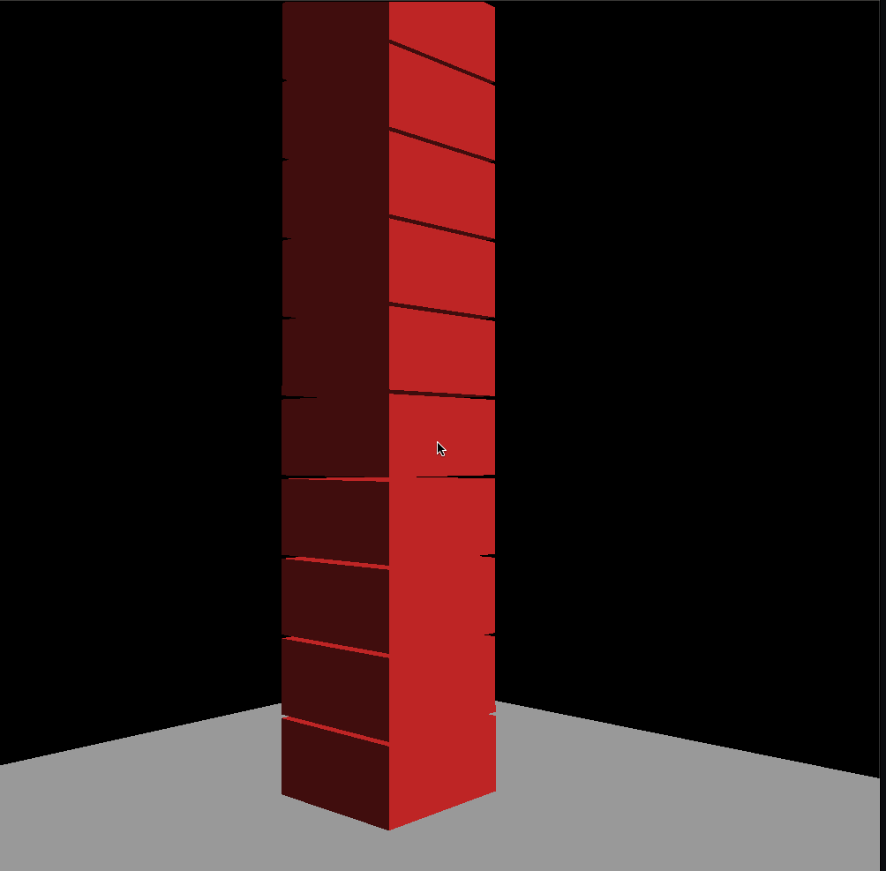
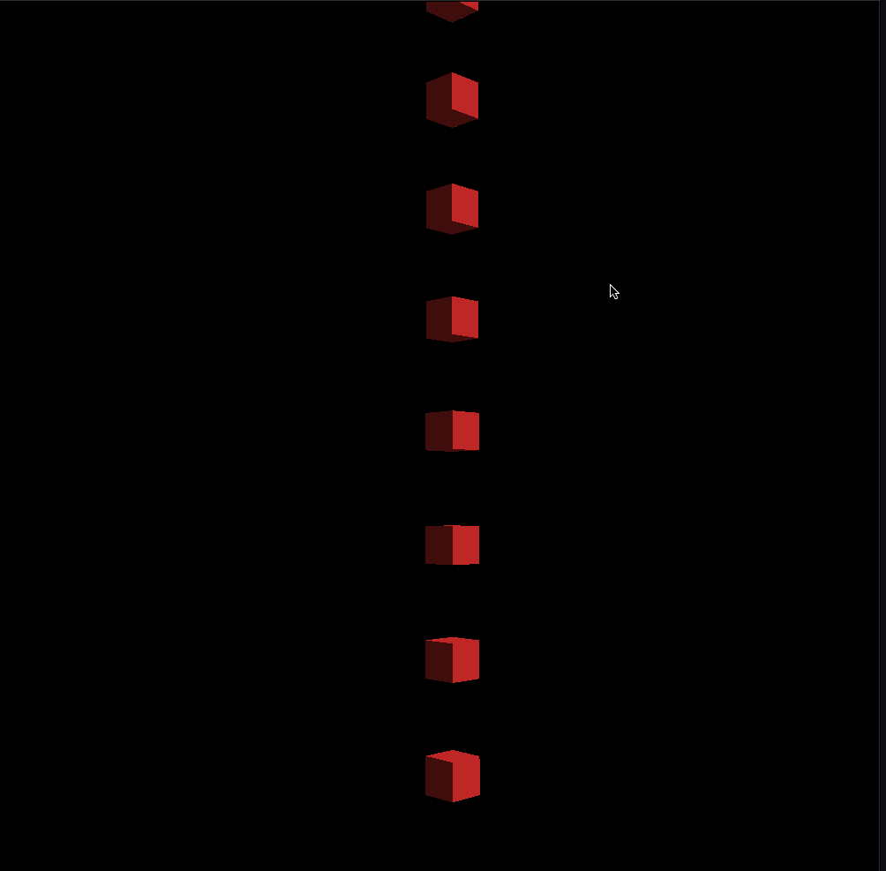

# Physics Engines

This is a Physics Engine used to simulate Rigid Bodies. Still in the early works. It uses PGS for collision response and SAT + GJK for collision detection.

## Features

- Rigid body dynamics
- Collision detection and resolution
- Joints and constraints
- Stack stability and sleep systems
- Constraint solvers and integrators
- Modular and extensible architecture

## Demos

### 📦 Box Stacking
*Demonstrates stability, restitution, and stacking under gravity.*



### 🔗 Joint Systems
*Showcases revolute joints.*



## Build Instructions

```bash
# Clone the repo
$ git clone https://github.com/yourname/physics-engines.git
$ cd physics-engines

# Build (example using CMake)
$ mkdir build && cd build
$ cmake ..
$ make
```

## Usage

Run the engine demo:
```bash
mkdir build
cd build
cmake ..
make && ./examples/boxstacking/BoxStacking
```

## Roadmap

- [ ] Add friction pyramid support
- [ ] GPU constraint solver
- [ ] Continuous Collision Detection
- [ ] Softbody dynamics
- [ ] Graph coloring to solve constraints
- [ ] TGS Solver

## License

MIT License. See `LICENSE` for details.

## Acknowledgments

- Based on techniques from "Game Physics" by David H. Eberly and "Physics-Based Animation" by Kenny Erleben.
- Inspired by Bullet, PhysX, and Box2D.
